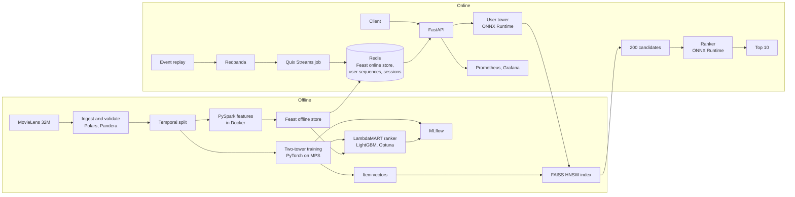

# StreamRank

A two-stage movie recommender that returns a user's next 10 movies in milliseconds on a laptop. A PyTorch two-tower model, with a causal transformer over the user's last 200 events, retrieves 200 candidates from the full catalog through a FAISS HNSW index. A LightGBM LambdaMART ranker then orders them using batch features from Feast. Every new event, streamed through Redpanda, updates the user's sequence and session features in Redis, so the next request reflects it. Built on MovieLens 32M with a strict temporal split, and evaluated against strong baselines with bootstrap confidence intervals.


## Results

<!-- results:begin -->
<!-- results:end -->

More results are in [docs/results.md](docs/results.md): baselines on both periods, the ranker's SHAP importance, index benchmarks, the interleaving replay, and serving latency. Decisions and their trade-offs are in [docs/adr](docs/adr).

What the numbers say:

- EASE, a linear item-to-item model, is the strongest single model on this data, and the two-tower model does not beat it on recall. [ADR 0006](docs/adr/0006-two-tower-retrieval.md) analyzes the gap by user segment. The two-tower model stays as the retrieval stage for three reasons: it serves from a nearest-neighbor index in under a millisecond, it uses the latest events without refitting, and it embeds new items from their content.
- The ranker adds a clear NDCG@10 gain over retrieval order.
- A replay of real next events with team-draft interleaving tells a different story ([ADR 0011](docs/adr/0011-online-test-simulation.md)). There the ranker only ties retrieval order, while retrieval clearly beats recent popularity. The offline metric rewards long-horizon relevance; the replay rewards the very next event, which is what the sequential model was trained to predict.

## Architecture



- **Temporal split.** Train before 2020-11-05, validation until 2022-02-01, test after. Features are computed point in time, and a test fails on leakage.
- **One feature definition module** feeds the Spark batch job and the streaming job. Parity tests compare Spark with Polars and the stream with batch.
- **Retrieval.** A SASRec-style user tower over the last 200 events and an item tower over ID, genres, year, and tags. Trained with sampled softmax over in-batch and random negatives, with log-Q correction.
- **Ranking.** 19 features: retrieval score and rank, item popularity over several windows, item age and ratings, user activity, genre affinity, and release-year gap. Tuned with Optuna, exported to ONNX, and checked for parity.
- **Serving.** FastAPI with ONNX Runtime and FAISS, a popularity fallback for unknown users, and Prometheus metrics. The same image runs in Docker Compose and on Kubernetes (kind, Helm, CPU autoscaling).


## Quickstart

You need [uv](https://docs.astral.sh/uv/), Docker, and GNU Make. No API keys or paid services.

```bash
make setup                 # Python 3.12 environment, .env from .env.example, git hooks
make data split            # download MovieLens 32M (checksum verified), split by time
make up features           # Redis, Postgres, MLflow; Spark features; Feast online store
make baselines train-retrieval build-index train-ranker
make export-onnx serving-artifacts
make up smoke              # API, demo, Grafana; one end-to-end request
make load                  # k6 load test
make final-run report      # refit on train + validation, score on test, write results
make kind-up helm-install  # optional: Kubernetes on kind with an HPA
```

[docs/SETUP.md](docs/SETUP.md) covers every stage, with run times and options. Run `make help` for all targets.

## Repository

| Path | Contents |
| --- | --- |
| `src/streamrank/` | data, features, models, retrieval, ranking, serving, streaming, simulation, monitoring, demo |
| `pipelines/spark/` | offline feature job |
| `feature_repo/` | Feast definitions |
| `services/` | Dockerfiles for the API, Spark, streaming job, MLflow, and demo |
| `deploy/` | Prometheus, Grafana dashboards, Helm chart, kind config |
| `loadtest/` | k6 script |
| `docs/` | roadmap, results, ADRs, model card, setup |

## Documentation

- [docs/results.md](docs/results.md): every result, written by `make report`
- [docs/model-card.md](docs/model-card.md): intended use, data, evaluation, limitations
- [docs/ROADMAP.md](docs/ROADMAP.md): milestones, per-milestone results, and what changed
- [docs/adr](docs/adr): architecture decision records

## Data

MovieLens 32M from [GroupLens](https://grouplens.org/datasets/movielens/32m/) (F. Maxwell Harper and Joseph A. Konstan, 2015, ACM TiiS). It is downloaded locally and never redistributed here. Tests use a synthetic generator with the same schema.

## License

MIT
