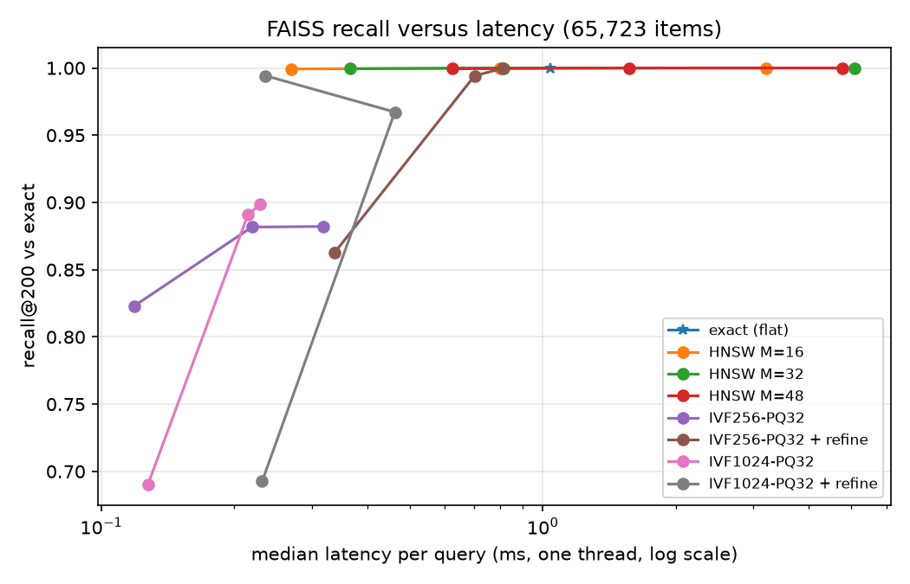

# FAISS index benchmark

Item vectors from `artifacts/retrieval/two_tower_full` (65,723 items, dimension 128); 6,463 validation users as queries. Each query fetches 400 items so that 200 remain after removing the user's training items. Latency is single-threaded, one query at a time, over 1,000 queries.

Chosen index: HNSW M=16, efSearch=400 (see ADR 0007). Latency was measured on a laptop with other jobs running; medians are stable, single p99 values are noisy.

| Index | recall@200 vs exact | Recall@100 | p50 ms | p99 ms | build s | size MB |
| --- | ---: | ---: | ---: | ---: | ---: | ---: |
| flat | 1.0000 | 0.2569 | 1.04 | 2.51 | 0.0 | 33.7 |
| hnsw(M=16,efC=200,ef=400) | 0.9992 | 0.2569 | 0.27 | 0.39 | 1.8 | 43.1 |
| hnsw(M=16,efC=200,ef=800) | 1.0000 | 0.2569 | 0.80 | 1.14 | 1.8 | 43.1 |
| hnsw(M=16,efC=200,ef=1600) | 1.0000 | 0.2569 | 3.20 | 5.36 | 1.8 | 43.1 |
| hnsw(M=32,efC=200,ef=400) | 0.9994 | 0.2569 | 0.37 | 0.62 | 3.3 | 51.5 |
| hnsw(M=32,efC=200,ef=800) | 1.0000 | 0.2569 | 0.81 | 1.07 | 3.3 | 51.5 |
| hnsw(M=32,efC=200,ef=1600) | 1.0000 | 0.2569 | 5.08 | 14.32 | 3.3 | 51.5 |
| hnsw(M=48,efC=200,ef=400) | 0.9995 | 0.2569 | 0.62 | 2.47 | 6.7 | 60.0 |
| hnsw(M=48,efC=200,ef=800) | 1.0000 | 0.2569 | 1.57 | 3.93 | 6.7 | 60.0 |
| hnsw(M=48,efC=200,ef=1600) | 1.0000 | 0.2569 | 4.76 | 8.43 | 6.7 | 60.0 |
| ivfpq(nlist=256,m=32,nprobe=8) | 0.8231 | 0.2440 | 0.12 | 0.27 | 79.9 | 2.9 |
| ivfpq(nlist=256,m=32,nprobe=32) | 0.8817 | 0.2513 | 0.22 | 0.43 | 79.9 | 2.9 |
| ivfpq(nlist=256,m=32,nprobe=64) | 0.8821 | 0.2513 | 0.32 | 0.68 | 79.9 | 2.9 |
| ivfpq(nlist=256,m=32,nprobe=8,refine x4) | 0.8627 | 0.2474 | 0.34 | 0.82 | 79.4 | 36.5 |
| ivfpq(nlist=256,m=32,nprobe=32,refine x4) | 0.9941 | 0.2568 | 0.70 | 3.81 | 79.4 | 36.5 |
| ivfpq(nlist=256,m=32,nprobe=64,refine x4) | 0.9996 | 0.2569 | 0.81 | 8.49 | 79.4 | 36.5 |
| ivfpq(nlist=1024,m=32,nprobe=8) | 0.6906 | 0.2343 | 0.13 | 0.42 | 83.9 | 3.3 |
| ivfpq(nlist=1024,m=32,nprobe=32) | 0.8912 | 0.2503 | 0.22 | 1.84 | 83.9 | 3.3 |
| ivfpq(nlist=1024,m=32,nprobe=64) | 0.8984 | 0.2508 | 0.23 | 1.11 | 83.9 | 3.3 |
| ivfpq(nlist=1024,m=32,nprobe=8,refine x4) | 0.6926 | 0.2368 | 0.23 | 0.57 | 92.7 | 36.9 |
| ivfpq(nlist=1024,m=32,nprobe=32,refine x4) | 0.9672 | 0.2559 | 0.46 | 0.95 | 92.7 | 36.9 |
| ivfpq(nlist=1024,m=32,nprobe=64,refine x4) | 0.9942 | 0.2565 | 0.24 | 0.35 | 92.7 | 36.9 |
